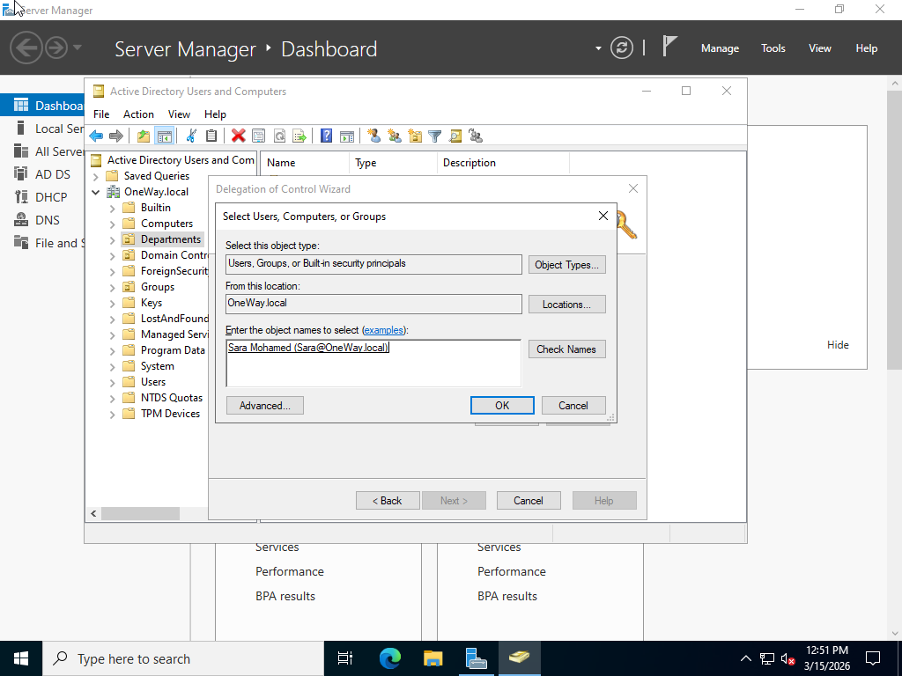
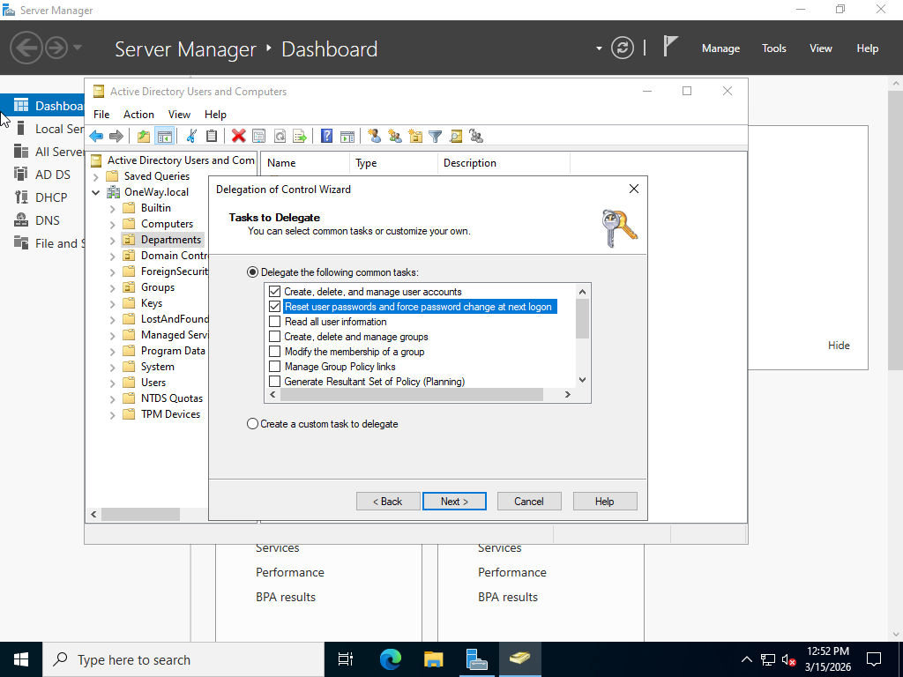
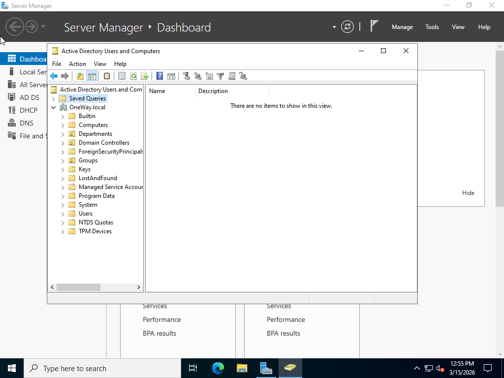
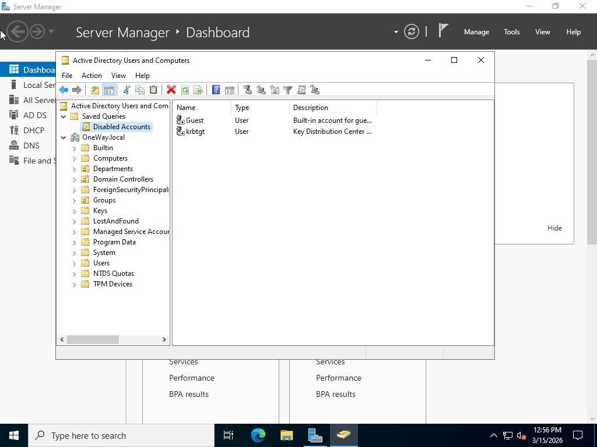

# AD-Advanced-Administration-Lab
# Active Directory Advanced Administration Lab

## Overview

This lab demonstrates several advanced administration tasks in an Active Directory environment.

The goal of this lab is to simulate real-world system administrator tasks such as delegation administrative permissions, and creating saved queries for easier management.

---

## Lab Environment

Domain Controller: DC01  
Domain: OneWay.local  
Client Machine: Windows 10  

Technologies Used:

- Windows Server 2022
- Active Directory

---

## Lab Tasks

### 1. Delegation of Control

Delegation allows administrators to grant limited permissions to specific users without giving full domain administrator access.

Steps:

- Open Active Directory Users and Computers
- Right click the OU
- Select **Delegate Control**
- Add a user
- Assign specific permissions such as:
  - Reset user passwords
  - Create and delete users

---

### 2. Active Directory Saved Queries

Saved Queries allow administrators to quickly search and filter objects inside Active Directory.

Example query:

Disabled Accounts

Steps:

- Open Active Directory Users and Computers
- Right click **Saved Queries**
- Create a new query
- Filter for disabled user accounts

---

## Screenshots

### Delegation Wizard

### Delegated Permissions

### Saved Query Creation

### Query Results

---

## Result

Advanced Active Directory administration tasks were successfully implemented.

This lab demonstrates how administrators can delegate permissions securely, and simplify directory management using saved queries.
